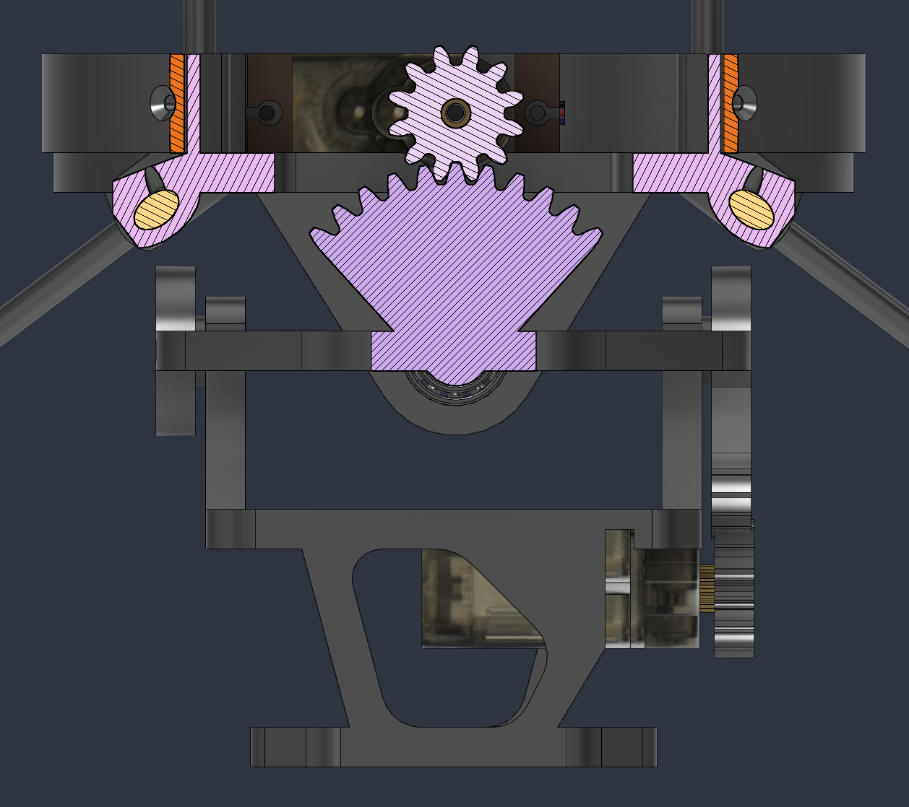
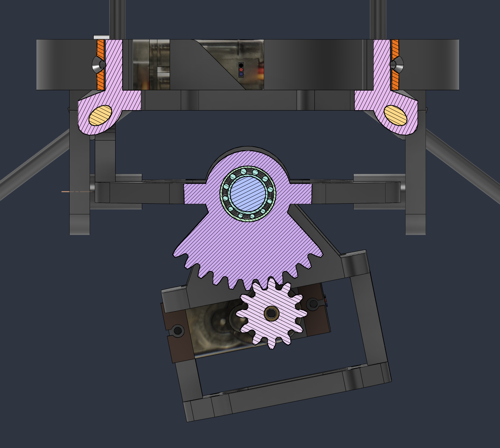

# Index

1. [Design](#design)
	  - [Hardware Specifications](#hardware-specifications)
	  - [Coaxial Design](#coaxial-design)
	  - [Gimbal Design](#gimbal-design)
	  - [Body Design](#body-design)
	  - [Sensor Placement and Configuration](#sensor-placement-and-configuration)
2. [PCB](#pcb)
	  - [Component Overview](#component-overview)
	  - [System Initialization and Checks](#system-initialization-and-checks)
	  - [Microcontroller and Sensors](#microcontroller-and-sensors)
	  - [Data Logging Architecture](#data-logging-architecture)
	  - [Power System](#power-system)
	  - [Custom Sensor Modules](#custom-sensor-modules)
	  - [Power Delivery System](#power-delivery-system)

# Design

This section explains the hardware design of the drone along with why it was designed that way. Key hardware components and major design choices were made during the process of building, and each of them will be explained in the following sub-sections.

1. Hardware Specifications
2. Coaxial Design
3. Gimbal Design
4. Body Design

### **Hardware Specifications**

The drone uses the following core hardware components to achieve flight:
- **Motors**: DZP30 counter-rotating motors (KV: 1500, Thrust: ~280g each, Current: 0.5A at 11.1V).
- **ESCs**: XP-12A (12A rating, with BEC).
- **Propellers**: 7035 (7-inch diameter, 3.5-inch pitch, 3-blade, 5mm inner hole).
- **Battery**: 3S 1500mAh 45C LiPo with JST connector.

### **Coaxial Design**

Unlike a traditional rocket engine that doesn't produce any significant amount of z-axis torque, using a spinning motor with propellers introduces z-axis torque. The z-axis rotational dynamics are governed by two factors. A major dynamic at hand which is constantly present when the motors are spinning is the torque that is applied in the opposite direction of the spinning motor. This dynamic would not be present in a complete vacuum when the motor is not being either accelerated. Since there is no change in angular momentum without acceleration, there is effectively zero torque. However, in the real world, propellers attached to the motors create thrust by accelerating the air molecules which, according to Newton's third law of motion induces force in the opposite direction. This has the effect of decelerating the motors. In order to maintain a constant angular velocity, the motors need to accelerate, thus creating an equal and opposite torque on the body even when the motors are maintaining their angular velocity. Second, another dynamic at hand is the conservation of angular momentum. This can be seen when the motor accelerates by increasing/decreasing its angular velocity. 

For a drone to achieve stability it needs to be able to control it's z-axis. This is the reason for choosing the coaxial design. Having two motors rotating in the opposite direction allows the torque to cancel each other. In an ideal scenario, where both motors spin at the same angular velocity and produce equal amount of thrust(each of them producing 1/2 of total thrust) torques produced should have the same magnitude and be directed at opposite directions, making the net torque 0. However, real world is far from the ideal case. since two propellers are stacked on top of each other airflow from top propellers create iregullarties from the ideal scenario. Thus, we need to be able to control the angular velocity of each counter rotating motors individually. By accelerating one motor and decellerating the other appropriately, this system is capable of producing the same amount of thrust while creating a torque in the desired direction.

### **Gimbal Design**

The gimbal uses two cheap and widely available MG90S servos. Metal gear servos were particularly chosen because they have far less backlash than soft geared servos. The specific model was chosen because of its cheap price. 3D printed gears were used on both axis to reduce the amount of torque each motor has to generate and to allow the gimbal control to be more precise. However, the use of gears resulted in its own backlash problem, which had to be reduced by iteratively testing different gear diameters. 

In the design, one of the gears have a normal 3:1 reduction ratio, and the other has a 4:1 gear reduction ratio. This is due to the geometry of how the servos are mounted. Servo-x is operated like a normal gear with a gear ratio of 3:1 and has a fixed spinning axis, as shown in section analysis below.

	

However, the gear attached to the servo-y revolves around the TVC axis as it rotates. This rotation of the axis makes it necessary for the servo to make an additional full rotation when TVC is rotated 360 degrees making the gear ratio 4:1. This effect has to be accounted for when managing TVC angles in software.

	

### **Body Design**

The body frame ware structured using 3mm solid carbon fiber rods cut to appropriate lengths to make the drone light weight and rigid. The rods are held together by custom designed 3D printed pieces. The rods are held to the 3D printed part by screws that was screwed into place by making the diameter of the hole in the 3D printed part slightly smaller than screw size. A small indent was made on the rod in the position of the screw, so that the indent would hold the rod in place.

The body was made to be long, and most of the mass(including the battery, motors, radio antenna) were located far from the center of mass intentionally! Since the moment of inertia is equivalent to 

$$I = \sum_{i=1}^{n} m_i r_i^2$$

where $r_i$ is the distance of small mass $m_i$ from the center of gravity, distributing the components with mass increases the moment of inertia of an object. Increased moment of inertia makes the tipping of the drone slower, since by definition moment of inertia is the resistance to change in angular velocity.

Other reasons for this design choice can be seen clearly with a simple example of the same 2D system with a proportional controller. Imagine a system that responds to an error by tilting the tvc gimbal proportionally to $\theta$(the error from desired angle of 0).

For small tvc deflection angle $\phi$,

$$ \tau = -F_t \cdot d \cdot \sin(\phi) \approx F_t \cdot d \cdot \phi$$
$$ I_{cg} \ddot \theta = -F_t \cdot d \cdot \phi$$

Since we are modeling a proportional controller,

$$\phi = K_p \theta$$
$$ I_{cg} \ddot \theta = -F_t \cdot d \cdot K_p \theta$$
$$  \ddot \theta + \frac {F_t \cdot d \cdot K_p}{I_{cg}} \theta = 0$$

This is similar to the equation of undamped harmonic oscillator which is written as
$\ddot x + \omega_n^2 x = 0$ where $\omega$ is the natural frequency of the system.

Thus, the closed loop natural frequency of this system can be expressed as

$$\omega_n = \sqrt{\frac {F_t \cdot d \cdot K_p}{I_{cg}}}$$

From this model, we can see that the closed-loop natural frequency increases as $I_{cg}$ decreases. A small $I_{cg}$ leads to rapid, high-frequency oscillations around the target angle. This is highly problematic for a real-world TVC drone because physical hardware constraints-such as a 50Hz servo refresh rate and non-zero servo transit time-are omitted from the ideal model. High frequencies paired with servo lag induce a catastrophic phase shift, leading to instability. By increasing $I_{cg}$, we effectively shift control authority from the chaotic, high-frequency raw rotational dynamics of a light airframe over to a tunable software parameter $K_{p}$. The enlarged $I_{cg}$ suppresses the natural frequency ceiling, allowing $K_{p}$ to be aggressively increased to reject wind disturbances heavily without forcing the servos past their physical bandwidth limitations.

### **Sensor Placement and Configuration**

Proper sensor placement and configuration are critical for accurate state estimation, particularly for sensors interacting directly with the ground.

- **IMU (ICM-42688-P)**: Configured in `main.c` for $\pm8$G acceleration and $\pm500$ degrees/sec, sampling at 1760Hz to minimize phase delay before filtering.
- **Barometer (BMP388)**: Configured to sample at 50Hz with 8$\times$ oversampling for pressure, balancing noise reduction with responsiveness.
- **Time of Flight (ToF) Sensor (VL53L1X)**: Placed facing directly downwards at one of the legs of the drone to measure altitude. The sensor is theoretically capable of measuring up to 4 meters, which perfectly aligns with the crucial low-altitude landing and hovering phases. 
- **Optical Flow Sensor (PMW3901)**: Mounted on one of the drone's outer legs located opposite of the leg ToF sensor is mounted to, due to space constraints and line-of-sight requirements. Because the leg mounts are angled, the sensor's native X and Y axes sit at a 45-degree angle relative to the flight controller's primary coordinate frame. To resolve this, the firmware mathematically rotates the raw PMW3901 readings by 45 degrees before fusing them into the velocity estimators.

# PCB

This section explains the architectural and hardware design choices behind the flight controller PCB, focusing on component selection and power delivery.

The PCB was designed using KiCAD, an open-source electronics design automation suite. The selection of components was crucial, as it dictates the capabilities, stability, and future extensibility of the TVC drone.

### **Component Overview**

| Type         | Model            | Interface   | Purpose                                 |
| ------------ | ---------------- | ----------- | --------------------------------------- |
| MCU          | STM32F722RET     | SWD         | Main flight controller processor        |
| IMU          | ICM-42688-P      | SPI         | 6-axis gyroscope and accelerometer      |
| Magnetometer | BMM150           | I2C         | Z-axis rotation and absolute heading    |
| Barometer    | BMP388           | SPI         | Altitude and temperature sensing        |
| GPS          | U-blox NEO-7     | UART/Custom | Global Positioning System               |
| Power Sensor | INA226           | I2C         | Battery voltage and current monitoring  |
| Flash Memory | W25Q128JVSIQ     | SPI         | 16MB onboard flight data logging        |
| SD card      | TF-01A           | SDMMC       | Removable post-flight data storage      |
| USB OTG      | USB4105-GF-A-120 | USB-C       | Debugging and data extraction           |
| Power Mux    | TPS2121          | -           | Intelligent battery/USB power switching |
| Buzzer       | MLT-8540         | GPIO        | Audiovisual feedback                    |

### **System Initialization and Checks**

During boot, the flight controller executes `sys_init()` function to initialize the system. The function initializes all the components of the drone and tries to establish a connection with the GCS(Ground Control Station). 

A `sys_check()` function can also be run afterwards by sending "CHECK" command from the GCS. This ensures all sensors and components are functioning correctly before launch. The function includes:

1. **Audiovisual Feedback**: Testing the Buzzer and LEDs.
2. **Actuator Sweeps**: Commanding the X and Y servos, followed by the main motors, through a limited sweep to confirm ESC and servo responses.
3. **Sensor Polling**: Verifying the IMU (ICM-42688-P), Magnetometer (BMM150), Barometer (BMP388), and Power Sensor (INA226) are successfully responding to SPI/I2C DMA requests.
4. **Memory Verification**: Erasing and writing a test sector on the W25Q128 flash memory, and writing a mock CSV file to the SD card to ensure data logging will not fail mid-flight.

### **Microcontroller and Sensors**

The **MCU (Microcontroller Unit)** is responsible for running the attitude control loops, reading sensor data, and commanding the servos and motors. The STM32F722RET was chosen for its compact size, high clock speed, and rich set of hardware peripherals (SPI, I2C, SDMMC).

The **IMU (Inertial Measurement Unit)** provides the foundational gyroscope and accelerometer readings necessary for attitude stabilization. While the IMU accurately tracks X and Y axis rotations (pitch and roll), it cannot determine absolute Z-axis orientation (yaw) without drift. Therefore, a **Magnetometer (BMM150)** is included to sense the Earth's magnetic field and provide drift-free yaw measurements.

A **Barometer (BMP388)** is also included to detect minute changes in air pressure, allowing the flight controller to estimate the drone's altitude. 

### **Data Logging Architecture**

For debugging and performance tuning, a robust logging system is critical. The PCB utilizes a two-stage logging approach to handle high-speed data:

1.  **In-Flight (High Speed)**: During flight, sensor data and control variables are logged via SPI to the onboard **W25Q128JVSIQ 16MB Flash Memory**. Writing directly to a physical SD card during flight is avoided because mechanical vibrations can cause brief disconnections, leading to fatal latency spikes or corrupted files. The flash memory uses a **Variable-Field Bitmask Serialization** format to tightly pack only necessary fields into 256-byte pages, maximizing the 16MB capacity.
2.  **Post-Flight (Data Extraction)**: After the flight controller receives a "KILL" command (disarming the vehicle), the logged binary data is automatically dumped from the flash memory into the **MicroSD card**, converting it into a readable CSV format (`flight.csv`). This method guarantees data integrity while providing an easily accessible file for ground station analysis. This approach was heavily inspired by the designs of flight controllers from BPS.Space.

### **Power System**

Power distribution is essential for stable flight, especially when multiple high-current servos and motors share the same supply as sensitive I2C sensors.

- The INA226 power sensor is explicitly configured for ultra-fast 140µs voltage conversion times. This guarantees that battery voltage telemetry does not bottleneck the strict 100Hz real-time attitude control loop.
- A 3.3V Step-Down Converter is used to efficiently step down the 3S LiPo battery voltage for the logic components.
- The main battery directly drives the ESCs and servos, removing massive current spikes from the logic rails.

### **Custom Sensor Modules**

The PMW3901 (Optical Flow) and VL53L1X (Time of Flight) sensors are used as modules rather than as embedded sensors in the main flight controller PCB.
- This allows optimal downward-facing placement, minimizing interference from the drone's frame or propellers.
- The flexibility means if a crash damages a sensor leg, I only have to replace the small module rather than the entire flight controller stack.
- **DMA and Semaphore Safety**: Because these sensors communicate over external wires, they are susceptible to electrical noise or disconnects mid-flight. To prevent a dead I2C/SPI bus from hanging the CPU and crashing the drone, all sensor polling is offloaded to hardware DMA channels, wrapped in FreeRTOS Mutexes, and bound by OS-level timeouts.

### **Power Delivery System**

The power route follows the path: +BATT -> motors -> +5V -> servos -> +3.3V -> STM32 & sensors.

Unlike standard quadcopters that rely on the limited Battery Elimination Circuit (BEC) from an ESC to power the flight controller, this TVC drone requires significant current for the 2 onboard servos, which needs to be constantly actuated during flight. To address this, the PCB is powered directly from the 3S LiPo battery via screw terminals and steps down the voltage onboard:

*   **Buck Converter (MP2393)**: Drops the +11.1V (3S LiPo) to a stable +5V to power the MG90S servos. The MP2393 was selected for its high efficiency under significant current draw. The Power Good (PG) pin is routed to an STM32 GPIO for power status monitoring (currently not in use).

*   **Linear Regulator (AMS1117-3.3)**: Steps down the +5V rail to an clean +3.3V to power the STM32 MCU and sensitive I2C/SPI sensors.

### **Dual-Power USB Switching**

The flight controller can be powered by either the LiPo battery or the USB-C connection during bench testing. To prevent dangerous back-driving of voltage into the USB port while the battery is connected, a **TPS2121 Power Multiplexer** is used. It is configured to automatically prioritize the battery input (IN1) as long as it remains above 3.3V, providing seamless power switching and VBUS protection. An **INA226** IC is also placed in line to monitor the battery's voltage and current draw, enabling dynamic ESC throttle compensation as the battery drains.

Additionally, to protect the USB connection from Electrostatic Discharge (ESD), the datalines are guarded using **USBLC6-2SC6**, and the VBUS line is protected via **ESDA7P60-1U1M**. A VBUS sensing circuit allows the MCU to only attempt USB communication when genuinely connected.