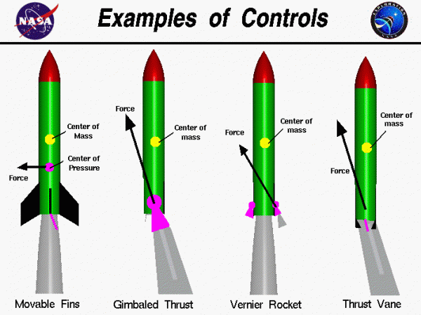
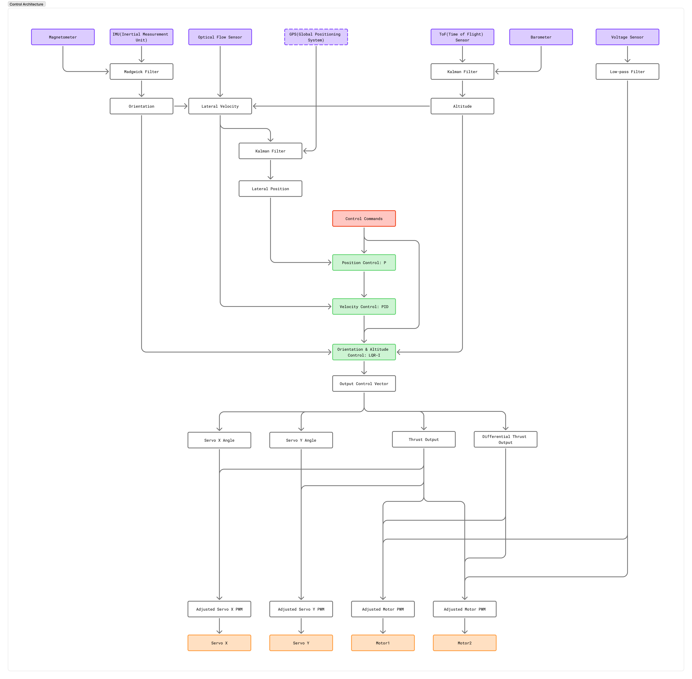
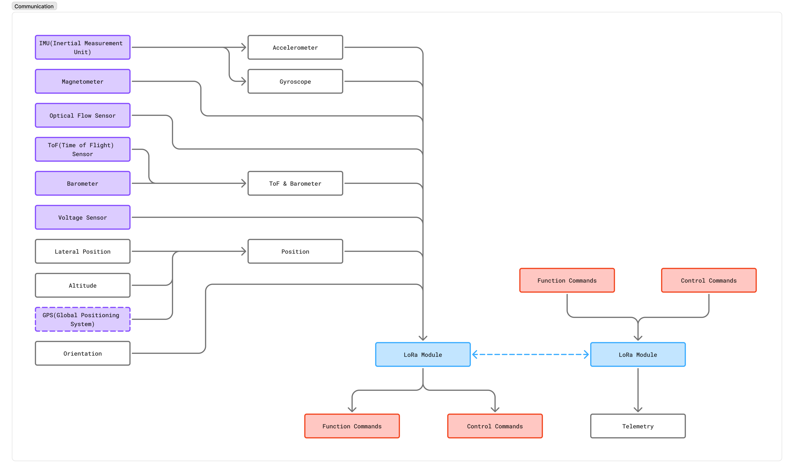
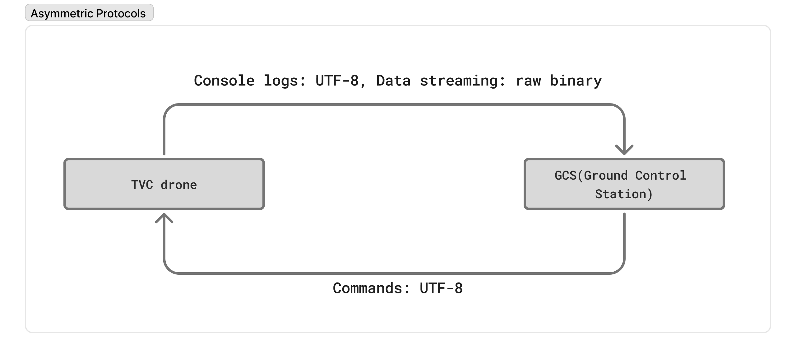
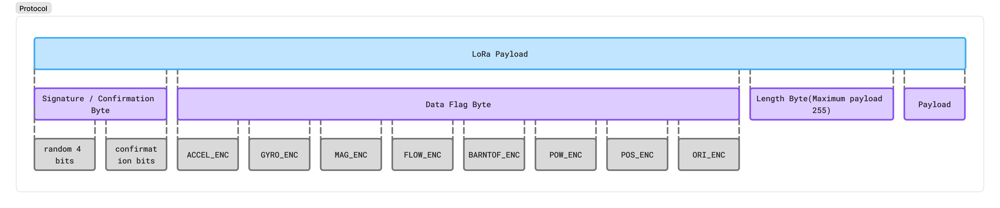

# 목차
1. [제어](#제어)
	- [LQR](#lqr)
	- [비용 함수와 이산 대수 리카티 방정식(DARE)](#비용-함수와-이산-대수-리카티-방정식dare)
	- [최적 게인과 제어 법칙](#최적-게인과-제어-법칙)
	- [PID](#pid)
	- [적분 와인드업 방지 메커니즘](#적분-와인드업-방지-메커니즘)
	- [LQR 서보 매핑](#lqr-서보-매핑)
2. [센서 퓨전](#센서-퓨전)
	- [자세 퓨전](#자세-퓨전)
	- [고도 퓨전](#고도-퓨전)
	- [속도 퓨전](#속도-퓨전)
	- [저역 통과 필터](#저역-통과-필터)
	- [센서 보정](#센서-보정)
3. [통신](#통신)
	- [LoRa 구성](#lora-구성)
	- [비대칭 통신 프로토콜](#비대칭-통신-프로토콜)
	- [패킷 구조](#패킷-구조)
	- [FreeRTOS](#freertos)
	- [비행 상태](#비행-상태)

# 제어

TVC 시스템을 구현하는 방법에는 크게 네 가지가 있습니다: 움직이는 핀(movable fins), 짐벌 추력(gimbaled thrust), 버니어 로켓(vernier rocket), 추력 베인(thrust vanes).

	

그러나 SpaceX의 팰컨 9와 스타십, 로켓랩의 일렉트론, NASA의 SLS, KARI의 누리(KSLV-II), JAXA의 H3, CASC의 창정, ESA의 아리안 등 대부분의 현대 로켓들은 비행 중 조종성을 확보하기 위해 짐벌 추력 방식을 사용합니다.

전반적으로 드론에서 제어 가능한 값은 서보-x, 서보-y, 모터1, 모터2에 대한 PWM 신호입니다. 이를 통해 드론은 x, y, z축 전체에 걸쳐 자세와 위치를 제어할 수 있습니다.
### **LQR**

드론의 자세와 고도를 제어하는 데 사용되는 제어 방식 중 하나는 **LQR(선형 이차 조절기, Linear Quadratic Regulator)**입니다. 이는 시스템의 현재 상태를 반영하는 상태 벡터와, 시스템의 물성치를 이용해 사전에 계산된 행렬을 사용하여 오차를 최소화하는 방향으로 액추에이터를 구동합니다. 게인 행렬이 사전에 최적으로 계산되기 때문에, 번거로운 수동 튜닝 과정을 생략할 수 있으며, 오차 종류와 액추에이터 사용 페널티 간의 균형을 맞추기 위한 벤치 테스트만 필요로 합니다.

이 제어기는 자세/고도 오차와 그 미분값, 적분값으로 구성된 12개 상태의 증강 벡터를 대상으로 동작합니다.

$$
\mathbf{x} = \begin{bmatrix} r_x & r_y & r_z & p_z & \dot{r}_x & \dot{r}_y & \dot{r}_z & \dot{p}_z & \int r_x & \int r_y & \int r_z & \int p_z \end{bmatrix}^T \in \mathbb{R}^{12}
$$

여기서 $r_x, r_y, r_z$는 롤/피치/요 자세 오차이고, $p_z$는 고도(위치-z) 오차이며, $\dot{(\cdot)}$ 항은 각각의 변화율, $\int(\cdot)$ 항은 정상상태 오차 제거를 위해 추가된 누적 적분값입니다.

이 시스템은 다음과 같은 선형 시불변(LTI) 플랜트로 모델링됩니다.

$$
\dot{\mathbf{x}} = A_c \mathbf{x} + B_c \mathbf{u}
$$

여기서 상태 행렬 $A_c$는 운동학적 관계를 나타냅니다.

$$
A_c =
\left[\begin{array}{cccccccccccc}
0&0&0&0&1&0&0&0&0&0&0&0\\
0&0&0&0&0&1&0&0&0&0&0&0\\
0&0&0&0&0&0&1&0&0&0&0&0\\
0&0&0&0&0&0&0&1&0&0&0&0\\
0&0&0&0&0&0&0&0&0&0&0&0\\
0&0&0&0&0&0&0&0&0&0&0&0\\
0&0&0&0&0&0&0&0&0&0&0&0\\
0&0&0&0&0&0&0&0&0&0&0&0\\
1&0&0&0&0&0&0&0&0&0&0&0\\
0&1&0&0&0&0&0&0&0&0&0&0\\
0&0&1&0&0&0&0&0&0&0&0&0\\
0&0&0&1&0&0&0&0&0&0&0&0
\end{array}\right]
$$

그리고 입력 행렬 $B_c$는 액추에이션 벡터 $\mathbf{u} = \begin{bmatrix} u_0 & u_1 & u_2 & u_3 \end{bmatrix}^T$(서보-x, 서보-y, 차동 추력, 메인 추력)를 물리적 제어 효율 상수 $B_{rx}$, $B_{ry}$, $B_{rz}$, $B_{pz}$로 스케일링하여 변화율 상태로 매핑합니다. $B_{rx}$와 $B_{ry}$ 값은 바이필러 진자(bifilar pendulum)를 사용해 x, y축에 대한 무게중심 관성 모멘트를 계산하여 구했으며, $B_{rz}$는 다양한 모터 rpm 차이에서의 z축 각가속도를 실험적으로 측정하여 구했습니다. 마지막으로 $B_{pz}$는 단순히 드론의 최종 질량을 이용해 계산되었습니다.

$$
B_c =
\left[\begin{array}{cccc}
0&0&0&0\\
0&0&0&0\\
0&0&0&0\\
0&0&0&0\\
-B_{rx}&0&0&0\\
0&B_{ry}&0&0\\
0&0&B_{rz}&0\\
0&0&0&B_{pz}\\
0&0&0&0\\
0&0&0&0\\
0&0&0&0\\
0&0&0&0
\end{array}\right]
$$

비행 컨트롤러는 고정된 제어 루프 주기로 동작하므로, 연속 시간 플랜트는 샘플 시간 $\Delta t$의 영차 유지(zero-order hold)를 통해 이산 시간으로 변환됩니다.

$$
\mathbf{x}_{k+1} = A_d \mathbf{x}_k + B_d \mathbf{u}_k, \qquad (A_d, B_d) = \mathrm{ZOH}(A_c, B_c, \Delta t)
$$

LQR 게인은 다음과 같은 무한 구간 이차 비용을 최소화함으로써 구해집니다.

$$
J = \sum_{k=0}^{\infty} \left( \mathbf{x}_k^T Q \, \mathbf{x}_k + \mathbf{u}_k^T R \, \mathbf{u}_k \right)
$$

여기서 $Q \in \mathbb{R}^{12\times12}$는 상태 오차(자세, 변화율, 적분항)에, $R \in \mathbb{R}^{4\times4}$는 액추에이터 사용에 페널티를 부여합니다.

$$
Q = \operatorname{diag}\big(q_{r_x},\, q_{r_y},\, q_{r_z},\, q_{p_z},\, q_{\dot r_x},\, q_{\dot r_y},\, q_{\dot r_z},\, q_{\dot p_z},\, q_{\int r_x},\, q_{\int r_y},\, q_{\int r_z},\, q_{\int p_z}\big)
$$

$$
R = \operatorname{diag}\big(r_{u_0},\, r_{u_1},\, r_{u_2},\, r_{u_3}\big)
$$

최적 비용-투-고(cost-to-go) 행렬 $P$는 DARE를 풀어 구합니다.

$$
P = A_d^T P A_d - A_d^T P B_d \left( R + B_d^T P B_d \right)^{-1} B_d^T P A_d + Q
$$

이는 파이썬(`lqr_compute.py`) 또는 매트랩(`lqr_compute.m`)을 사용하여 풀 수 있습니다.

최적 피드백 게인 행렬은 $P$로부터 다음과 같이 직접 계산됩니다.

$$
K = \left( R + B_d^T P B_d \right)^{-1} B_d^T P A_d
$$

그리고 각 시간 단계에서 적용되는 제어 입력은 다음과 같은 선형 피드백 법칙입니다.

$$
\mathbf{u}_k = -K \, \mathbf{x}_k
$$

$K$는 전체 12개 상태의 증강 시스템에 대해 한 번만 계산되기 때문에, 서보, 차동 추력, 추력 벡터링 채널에 대한 게인들이 이미 서로 균형을 이루고 있습니다. 이를 통해 수동 PID 방식 튜닝의 필요성이 사라지며, 오차 억제와 액추에이터 사용 비용 간의 상대적 가중치를 미세 조정하기 위한 벤치 테스트만 남게 됩니다.
### **PID**
대부분의 드론은 비행 중 안정성을 유지하기 위해 PID(비례-적분-미분, Proportional Integral Derivative) 제어 방식을 사용합니다. 이 방식에서는 오차에 대한 제어 출력이 비례, 적분, 미분 게인 각각에 대해 튜닝된 계수로 구동됩니다. 비례항은 오차를 줄이는 방향으로 시스템을 유도하고, 적분항은 시스템의 부정확성을 보정하며, 미분항은 그렇지 않으면 진동하게 될 시스템에 대한 감쇠 역할을 합니다. 이에 대한 좋은 설명 영상이 있습니다: https://youtu.be/4Y7zG48uHRo?si=Jpp3Fp_0xEZwwcJJ

$$u(t) = K_p e(t) + K_i \int_{0}^{t} e(\tau) \, d\tau + K_d \frac{d e(t)}{dt}$$

적분과 미분은 이산 시간에서 계산상으로 계산되어야 하므로 이 함수는 다음과 같이 됩니다.

$$u(t_n) = K_p e(t_n) + K_i \sum_{k=0}^{n} e(t_k) \Delta t + K_d \frac{e(t_n) - e(t_{n-1})}{\Delta t}$$

XY(수평) 위치는 **캐스케이드 구조**를 사용하여 제어되었습니다. 이 캐스케이드 구조에서는, 목표 XY 자세는 XY 속도를 조절하는 PID 제어기에 의해 결정됩니다. 그리고 목표 XY 속도는 다시 XY 위치 오차를 조절하는 P 제어기에 의해 결정됩니다.

1. 위치 오차 → 목표 속도(P 제어기): 가장 바깥쪽 루프는 원하는 목표 좌표와 현재 3차원 위치 간의 차이를 계산합니다. 단순한 비례(P) 제어기가 이 거리 오차를 목표 속도로 변환합니다. 이를 통해 드론이 목표 지점으로 순간이동을 시도하는 대신, 통제된 속도로 이동하게 됩니다.
   - 튜닝($K_p$ = 0.5): 펌웨어는 X, Y축 모두에 대해 매우 보수적인 게인인 0.5를 사용합니다.
   - 클램핑: 이 단계의 출력은 큰 위치 변화 시 발생할 수 있는 불안정하고 고속의 급격한 움직임을 방지하기 위해 $\pm0.5$ m/s로 엄격하게 제한됩니다.

1. 속도 오차 → 목표 자세(PID 제어기): 중간 루프는 (광류 센서와 IMU 융합으로부터 얻은) 현재 추정 속도를 위치 루프에서 제공된 목표 속도와 비교합니다. 완전한 비례-적분-미분(PID) 제어기를 사용하여 목표 롤/피치 각도를 출력합니다. 앞으로 가속하려면 드론이 앞으로 기울어져야 합니다.
   - 튜닝($K_p$ = 0.140, $K_i$ = 0.040, $K_d$ = 0.008): 여기서의 게인들이 외곽 루프에 비해 훨씬 작다는 점에 주목하세요.
   - 클램핑: 목표 자세 출력은 $\pm0.2$ 라디안(약 $11.4^\circ$)으로 엄격하게 제한됩니다. 이 엄격한 제한은 드론이 양력을 저해하거나 회복 불가능한 전복을 유발할 수 있는 극단적인 기울기를 명령하지 않도록 방지합니다.

	

위치 제어는 드론의 드리프트를 방지하고자 할 때 필수적입니다. 드론이 무게중심 아래에서 추력을 생성하기 때문에, 이는 역진자(inverted pendulum)와 동역학적으로 유사합니다. 이는 본질적으로 불안정하며 전복되려는 경향이 있습니다. 더욱이 짐벌을 한 방향으로 기울이면 회전 토크뿐 아니라 병진 운동도 유발됩니다. 무게중심이나 서보에 약간의 정렬 불량이 있으면 시스템은 시간이 지남에 따라 서서히 드리프트하게 됩니다.

앞서 언급했듯이, XY 제어기는 속도를 위한 내부 PID 제어기와 위치를 위한 외부 P 제어기로 나뉩니다. 이 구조는 내부 제어기가 적분(I) 게인을 통해 체계적인 기계적 오프셋을 신속하게 흡수하도록 하는 동시에, 외부 위치 루프의 비례(P) 게인이 독립적으로 조정될 수 있게 합니다.
### **적분 와인드업 방지 메커니즘**
제어 아키텍처가 (위치 → 속도 → 자세) 캐스케이드 방식이기 때문에, 한 가지 중요한 문제가 발생합니다: 바로 적분 와인드업(integral windup)입니다. 드론이 강하게 밀려 서보가 물리적 최대 각도(포화)에 도달하면, 위치 및 속도 오차는 계속 커지게 되는데, 이는 드론이 더 이상 물리적으로 기울어져 이를 보정할 수 없기 때문입니다. 안전장치가 없다면, 속도 루프의 적분항이 비현실적으로 거대한 오차 값을 누적하게 될 것입니다. 드론이 (제약에서) 벗어나는 순간, 이 거대한 적분값은 드론이 반대 방향으로 격렬하게 튕겨 나가도록 만들 것입니다.

이를 해결하기 위해 펌웨어는 `freertos.c`에 지능형 **적분 와인드업 방지 메커니즘**을 구현합니다. 시스템은 다운스트림 출력(서보 각도 및 모터 추력)을 지속적으로 모니터링합니다. LQR 자세 제어기가 최대 허용 한계에 도달하면, 신호가 상위 체인으로 전달되어 속도 PID 제어기가 적분 누적기를 *동결*시키도록 합니다. 적분값은 시스템이 그것에 대해 실제로 작용할 수 있는 물리적 권한을 가지고 있을 때에만 증가하도록 허용됩니다.
### **LQR 서보 매핑**
LQR 출력 벡터($u$)는 정규화된 제어 노력값을 생성합니다. 이 값들은 하드웨어에 직접 쓸 수 없습니다. 대신, 혼합 행렬을 통해 두 짐벌 서보와 두 브러시리스 모터를 위한 특정 PWM 신호로 변환됩니다.
- 기준 오프셋(`LQR_SSO = 50`): 서보의 중립적인 직립 위치는 작동 범위의 50%로 정의됩니다. LQR 피치 및 롤 노력값은 이 기준 오프셋에서 스케일링되어 동적으로 더해지거나 빼집니다.
- 차동 추력: 드론에는 물리적인 요 서보가 없기 때문에, LQR 요 노력값($u_2$)은 추력 차동으로 매핑됩니다. 양의 요 명령은 모터1에 추력을 더하는 동시에 모터2에서 동일하게 빼서, 총 고도 양력에 영향을 주지 않으면서 회전 토크를 생성합니다.
# 센서 퓨전

제어 시스템에서 가장 중요한 부분은 센서입니다. 시스템이 자신이 어떤 상태에 있는지 전혀 알지 못한다면, 목표 상태로 스스로를 조종할 능력이 없습니다. 먼저 드론은 자신이 어떻게 자세를 취하고 있는지 알아야 하고, 두 번째로 자신이 어디에 위치해 있는지 알아야 합니다. PCB에는 많은 센서가 탑재되어 있으며, 커넥터를 통해 PCB에 연결되어 드론이 제대로 작동하도록 돕는 다른 센서들도 있습니다. 어떤 센서는 제한된 환경에서만 작동하고, 어떤 센서는 시간이 지남에 따라 드리프트되기 쉬우며, 또 다른 센서는 판독값에 너무 많은 노이즈가 섞여 있을 수 있습니다. 이러한 문제를 극복하기 위해서는 센서 판독값을 다양한 방식으로 융합하여 시스템의 정확한 상태를 얻어야 합니다.

### **자세 퓨전**
드론의 자세는 6축 IMU(관성 측정 장치)와 지자기 센서의 데이터로부터 유도됩니다. xioTechnologies의 fusion 라이브러리에 있는 매드윅(Madgwick) 필터가 센서 데이터를 융합하는 데 사용되었습니다. 매드윅 필터는 가속도계의 xyz 값을 사용해 중력의 방향을 추정하고, 이를 더 매끄러운 자이로스코프 판독값과 결합해 자세 값을 구합니다. 그러나 중력의 방향은 z축 방향에 관계없이 동일하기 때문에, IMU만으로는 정확한 z축 판독값을 얻을 수 없습니다. 지구 자기장의 방향을 감지하는 지자기 센서를 방위(heading)에 대한 절대 기준으로 사용해야 합니다. 매드윅 필터에 대한 보다 수학적인 설명은 여기에서 확인할 수 있습니다: https://ahrs.readthedocs.io/en/latest/filters/madgwick.html

z 위치(고도)를 얻기 위해 기압계, ToF(비행 시간) 센서, 그리고 IMU의 가속도계 값이 사용되었습니다. 기압계는 현재 위치의 대기압을 측정합니다. 대기압은 다음 공식에 따라 고도가 높아질수록 감소하므로:

$$
P = P_0 \cdot \left(1 - \frac{L \cdot h}{T_0}\right)^{\frac{g \cdot M}{R \cdot L}}
$$
$$
\frac{P}{P_0} = \left(1 - \frac{L \cdot h}{T_0}\right)^{\frac{g \cdot M}{R \cdot L}}
$$
$$
\left(\frac{P}{P_0}\right)^{\frac{R \cdot L}{g \cdot M}} = 1 - \frac{L \cdot h}{T_0}
$$
$$
\frac{L \cdot h}{T_0} = 1 - \left(\frac{P}{P_0}\right)^{\frac{R \cdot L}{g \cdot M}}
$$
$$
h(P) = \frac{T_0}{L} \cdot \left(1 - \left(\frac{P}{P_0}\right)^{\frac{R \cdot L}{g \cdot M}}\right)
$$

표준 온도($T_0$) = $288.15 \text{ K}$
기온 감률($L$) = $0.0065 \text{ K/m}$
중력 가속도($g$) = $9.80665 \text{ m/s}^2$
공기의 몰 질량($M$) = $0.0289644 \text{ kg/mol}$
기체 상수($R$) = $8.31432 \text{ J/(mol}\cdot\text{K)}$

이 값들을 대입하면 다음과 같이 됩니다:

$$
h(P) = 44330.0 \cdot \left(1.0 - \left(\frac{P}{100.0 \cdot P_0}\right)^{\frac{1}{5.255}}\right)
$$

이를 통해 고도를 계산할 수 있습니다.

ToF 센서는 지면 위 최대 2m까지의 제한된 범위를 가지지만 훨씬 더 정확한 고도 값을 제공합니다. 이 센서는 빛이 지면까지 왕복하는 데 걸리는 시간을 이용해 고도를 계산합니다. ToF 센서는 드론에 물리적으로 부착되어 있기 때문에 드론과 함께 기울어지며, 이로 인해 실제보다 더 큰 고도값이 측정됩니다. 이는 판독값을 x, y 자세각의 코사인 값으로 스케일링하여 보정할 수 있습니다.
### **고도 퓨전**
절대 Z축에 대한 선형 가속도, 기압계에서 유도된 고도, 그리고 보정된 ToF 센서의 고도 판독값은 칼만 필터를 사용하여 융합됩니다.

- **2미터 이하(ToF 범위 내)**: ToF 센서는 밀리미터 수준의 정밀도 덕분에 절대적인 기준으로 작동합니다. 이 단계에서 칼만 필터는 ToF를 크게 신뢰하며, 동시에 ToF 판독값을 이용해 기압계의 지면 오프셋을 지속적으로 재보정합니다.
- **2미터 초과(ToF 범위 밖)**: 드론이 2m 임계값을 초과하면 ToF 판독값은 신뢰할 수 없게 됩니다. 칼만 필터는 주 고도 추정을 기압계로 넘깁니다. 2m 영역을 벗어나기 직전에 기압계가 재보정되었기 때문에, 이 전환은 추정 고도의 급격한 변화 없이 매끄럽게 이루어집니다.
### **속도 퓨전**
X, Y 속도는 광류 센서(PMW3901)로 감지되며 위치 값으로 적분됩니다. 광류 센서는 지면의 패턴을 추적하여 각속도를 출력합니다.

광류 센서는 드론 몸체에 물리적으로 장착되어 있기 때문에, 드론이 기울어지기만 해도 표면 패턴에 잘못된 변화가 있는 것처럼 감지됩니다. 따라서 자이로스코프 자세 판독값으로부터 얻은 각속도를 광류 판독값에서 빼야 합니다. 또 다른 효과는 시차(parallax)로, 가까운 물체는 멀리 있는 물체보다 더 빠르게 움직이는 것처럼 보입니다. 원시 판독값은 현재 추정 고도를 기반으로 스케일링되어 실제 속도를 구합니다. 이후 이는 각 축에 대해 칼만 필터를 이용해 가속도계 값과 융합됩니다.

### **저역 통과 필터**
다음과 같은 형태의 이산 저역 통과 필터가

$$y_{n} = \alpha \cdot y_{n-1} + (1 - \alpha) \cdot x_{n}$$

노이즈를 걸러내기 위해 적절한 곳에 사용되었습니다.

### **센서 보정**
센서는 정렬 불량이나 오프셋을 보정하기 위해 사용 전에 반드시 보정되어야 합니다. 지자기 센서는 MotionCal 애플리케이션을 사용해 3x3 보정 행렬을 도출함으로써 연철(soft iron) 오차와 경철(hard iron) 오차 모두에 대해 보정되었습니다. 그리고 가속도계는 PCB 장착 오프셋과 센서 고유의 정렬 불량을 보정하기 위해 사전 보정되어 있습니다. 자이로스코프는 드론에 전원이 들어올 때마다 시작 시퀀스 초반에 보정됩니다.

# 통신

드론은 LoRa RF 모듈을 이용해 수신기와 통신합니다. 구체적으로, 데이터, 원격 측정값, 비행 명령을 장거리로 송수신하기 위해 드론에 하나, 지상국에 하나, 총 두 개의 **Ebyte E220-900T22D** 모듈이 사용됩니다.

	

### **LoRa 구성**

지역별 주파수 규정(예: 한국은 920.9~923.3 MHz를 허용)을 준수하고 도달 거리를 최적화하기 위해, Ebyte 모듈은 다음과 같은 파라미터로 구성됩니다:

| 설정 | 값 | 설명 |
| -------------------|-----------| -------------|
| 중심 주파수   | 922 MHz   | 합법적인 운용 대역 |
| 에어 데이터 레이트      | 19.2 kHz  | 처리량과 전송 거리 간의 균형 |
| 보드레이트           | 115200    | 모듈과 MCU 간 UART 속도 |
| 패리티 비트         | 8N1       | 8비트 데이터, 패리티 없음, 정지 비트 1개 |
| 서브패킷 길이  | 200 bit   | 패킷 분할용 버퍼 크기 |
| 전송 출력 | 10 dBm    | 출력 강도 |
| LBT(Listen Before Talk) | 활성화 | 충돌 방지를 위해 지역 규정상 요구됨 |

설정 모드로 진입하려면 Ebyte 모듈의 M0, M1 핀을 하이(high)로 풀업해야 합니다. 설정 명령은 `command + address + length + parameters` 형식을 따릅니다.

설정해야 할 주요 레지스터는 다음과 같습니다:
- **REG0**: UART 보드레이트, 에어 데이터 레이트, 시리얼 패리티 비트.
- **REG1**: 서브패킷 길이, 전송 출력.
- **REG2**: 채널 주파수(850.125 + REG2 MHz).
### **비대칭 통신 프로토콜**

	

표준 패킷 기반 네트워킹을 느슨하게 본떠 만든 커스텀 통신 프로토콜이 연결을 견고하게 하고 오버헤드를 최소화하기 위해 구현되었습니다.

통신 아키텍처는 비대칭적입니다:
1.  드론 → GCS(다운링크): 드론에서 GCS로 전송되는 원격 측정 데이터는 높은 처리량과 신뢰성을 요구합니다. 이는 커스텀 바이너리 프로토콜을 따르며, 촘촘하게 압축된 센서 판독값과 상태 플래그를 패킷 크기를 최소화하기 위해 원시 바이너리로 전송합니다.
2.  GCS → 드론(업링크): GCS에서 드론으로 전송되는 명령(예: 시동, 시동 해제, 보정)은 빈도가 낮으며 단순히 표준 UTF-8 문자열 형식을 사용합니다.
### **패킷 구조**

	

다운링크 원격 측정 프로토콜은 통신 오버헤드를 줄이기 위해 최소한의 3바이트 헤더로 설계되었으며, 이를 통해 19.2 kHz 에어 데이터 레이트가 구조적인 패딩이 아닌 실제 센서 데이터에 완전히 활용되도록 합니다.

# FreeRTOS
드론 펌웨어는 FreeRTOS를 사용하여 여러 동시 작업을 관리하며, (자세 제어와 같은) 엄격한 실시간 요구사항이 (로그 저장이나 무선 패킷 수신과 같은) 덜 중요하고 느린 작업에 의해 절대 차단되지 않도록 보장합니다.

시스템은 우선순위에 따라 다음과 같은 주요 작업들로 나뉩니다:
1.  `controlTask`(실시간 우선순위): 드론의 절대적인 핵심입니다. (CPU 차단을 방지하기 위해 DMA를 통한) 모든 센서 폴링을 처리하고, 칼만 필터를 실행하며, LQR 행렬을 실행하고, PWM 출력을 명령합니다.
    - 실행 주기: 기본 작업은 자세 내부 루프를 계산하기 위해 100Hz로 트리거됩니다.
    - 속도 데시메이션: 중간 속도 PID 루프는 `decimation_factor = 5`를 사용하여, 20Hz(자세 사이클 5회당 한 번)로만 실행됩니다.
    - 위치 데시메이션: 외부 위치 P 루프는 `decimation_factor = 10`을 사용하여, 10Hz(자세 사이클 10회당 한 번)로 실행됩니다. 이러한 엄격한 데시메이션은 캐스케이드 루프 전반에 걸쳐 대역폭 분리를 강제합니다.
2.  `commandTask`(높은 우선순위): 지상국으로부터 수신되는 LoRa 패킷을 처리합니다. FreeRTOS 뮤텍스를 통해 안전하게 전역 기준 목표값(롤, 피치, 요, Z-고도)을 갱신합니다.
3.  `loggerTask`(보통보다 높은 우선순위): 상태 데이터를 가변 필드 비트마스크 형식으로 압축하여 SPI 플래시에 기록합니다.
4. `telemetryTask`(보통 우선순위): 기본 원격 측정 패킷(배터리 전압, 고도, 드론 상태)을 형식화하여 지상국으로의 LoRa 전송을 위해 큐에 넣습니다.
5.  `transferTask`(실시간 우선순위 - 지상에서만): 이 작업은 비행 중에는 완전히 휴면 상태로 유지됩니다. 드론이 "KILL" 명령을 수신했을 때만 활성화됩니다. 활성화되면 CPU를 독점하여 원시 SPI 플래시 메모리를 신속하게 읽어 SD 카드에 형식화된 CSV 파일로 씁니다.

### **비행 상태**
펌웨어는 안전을 보장하고 지상에서의 제어 와인드업을 방지하기 위해 엄격한 상태 기계에 의존합니다:
1. **INIT(초기화)**: 부저, 서보, 모터, 센서를 테스트하기 위해 `sys_check()`를 실행합니다.
2. **DISARMED(시동 해제)**: 드론이 대기 상태입니다. 센서는 작동하지만 제어 루프는 우회되며 모터는 0으로 고정됩니다. 적분값은 0으로 유지됩니다.
3. **ARMED(시동)**: 모터가 공회전 속도까지 회전합니다. 제어 루프가 작동하여 현재 위치를 유지합니다.
4. **LAUNCH(발사)**: Z 기준 목표값이 부드럽게 상승하며, 드론에게 상승을 명령합니다.
5. **LAND(착륙)**: Z 기준 목표값이 천천히 하강합니다. 착지가 감지되면 드론은 자동으로 시동을 해제합니다.
